# 2D Platformer

- Based on [Zenva Course](https://academy.zenva.com/course/godot-2d-platformer-course/)

## Game Design
- Genre: 2D sidescrolling platformer
- Player 
  - Collects coins, avoids enemies, and reaches end flag to move to next level
  - moves left, right, and jumps
  - Smooth movement (Acceleration & braking)
    

image

  
    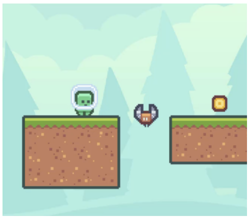
  

- Enemies
  - Moves back and forth between two points
  - Damages player when hit
    

      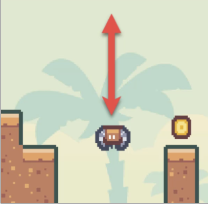
    

- Damage
  - health goes down by 1 heart
  - Screen flashes red
  - Screen shakes
  - Damage sounds
- Coins
  - increases score by 1 when collected
  - plays sound effect when collected
  - has rotating effect
  - bobs up and down
    

image

      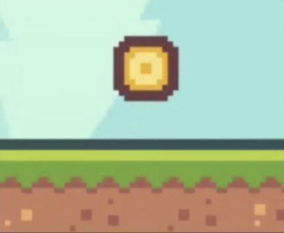
    

- UI
  -  Health represented by hearts
  -  Score denoted by number of coins collected
      

image

        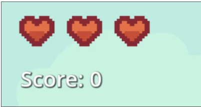
      

- End flag
  - placed at the end of each level
  - when touched, it loads up next level
    

image

      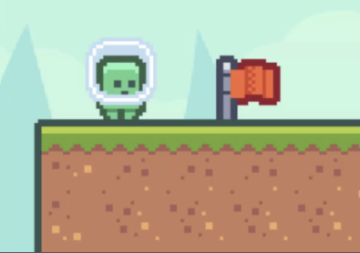
    

- Menu
  - play button
  - quit button
    

image

    
      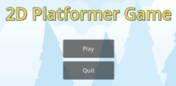
    

## Setup Project & Create First Level
- Create project
- Import assets
- Create Level 1
  - platforms should have physics/collision layer to prevent player from falling through
  - pixels should not look blurry
  - include a background in the level
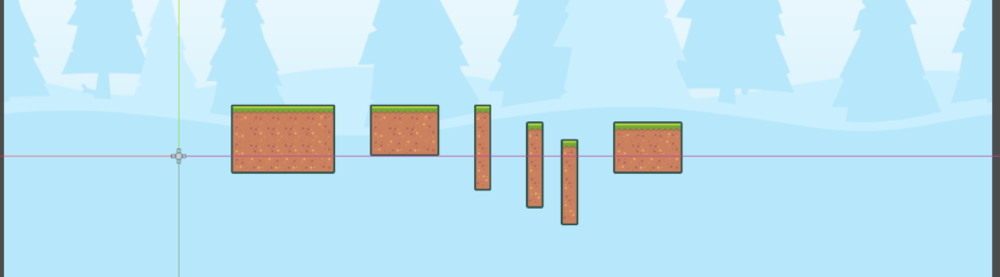

## Create Player Character
- Be able to control character with arrow, WASD, and spacebar keys
- Character should be able to move left, right, and jump
- Character should fall when off the platform (there should be gravity)
- Movement should not be rigid; should be smooth with very slight acceleration and deceleration
- Character animation should play when moving and jumping

    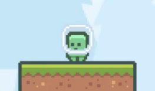

    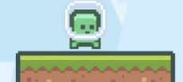

    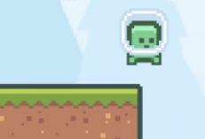

## Create Enemy
- Create "Enemy" that moves vertically or horizontally on a set path, in a loop
- Implement movement animation for enemy when it's in motion
- Implement collision detection so that it can detect when it touches the player 
    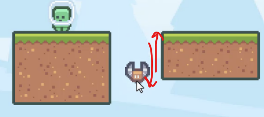

## Implement Game Over mechanic
- Implement damage functionality where player takes damage/ loses health when player touches enemy
- Cause player health to drop by 1 each time enemy is touched
- Cause game to restart (game over) when health reaches 0
  - cause game over when player falls off platform

## Create Coin
- Create "Coin" that remains in place, while slightly "rotating" and bobbing up and down
- Implement collision detection so when player touches coin, 
  - coin disappears
  - player's score increases by 1
    
    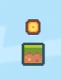

    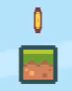

## Create Level End Flag
- Create end flag where when player touches it, it transitions to the next level
- Player score should persist when moving to next level 

    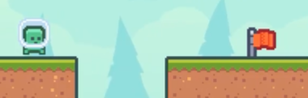

## Create UI (hearts and score display)
- Display player hearts representing player health
  - Health should update when player takes damage
- Display players score via text (ex: Score: 10)
  - Score should update when player collects coins
  - Score should persist when player moves to next level 
- UI should remain in top left corner

  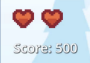

## Implement player damage feedback
- Make player flash red briefly when player takes damage
- Make screen shake when player takes damage

## Tiling background & Parallax effect
- Create tiling background to form a long strip that covers entire level

  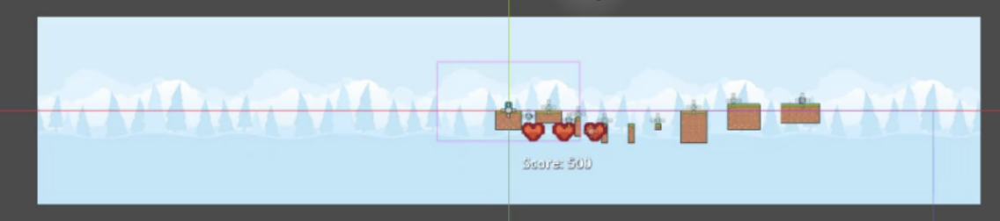
- Implement parallax effect where background moves at a different rate than foreground, creating a sense of depth

## Sound Effects
- implement sound effect to play when player collects coin
- implement sound effect to play when player takes damage

## Main menu
- set main menu as first screen player sees when starting game
- setup play button for starting level 1
- setup quit button for qutting game
- include game title
- update game over logic to return player to main menu when game over
