# 2D Platformer


## 1. Project Setup

### 1A. Create project folders:
- Audio, Sprites, Scripts, and Scenes
- Import assets into appropriate folders
  - https://mega.nz/folder/tOdyiITJ#HHo_NvrW6vjup-Wh5bCyzQ
  <details><summary>image</summary>

    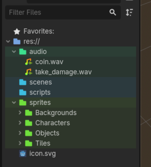
  </details>

### 1B. Setup main scene (level 1)
- Select "2D Scene"
  <details><summary>image</summary>

    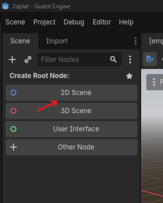
  </details>
  
- Rename "Node2D" to "Main"
  <details><summary>image</summary>

    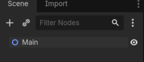
  </details>
- Save scene as "level_1" into scenes folder
  <details><summary>image</summary>

    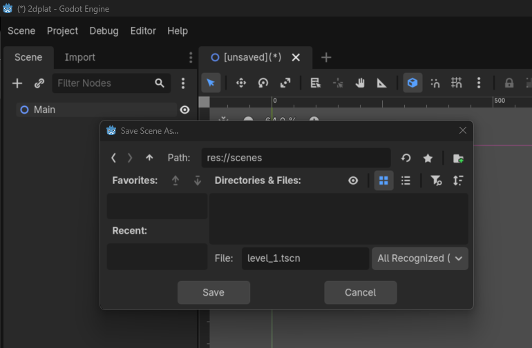
  </details>

## 2. Create platforms

### 2A. Create Tileset Resource
- Add `TileSet` resource to `Tiles` folder (name it whatever)
  <details><summary>image</summary>

    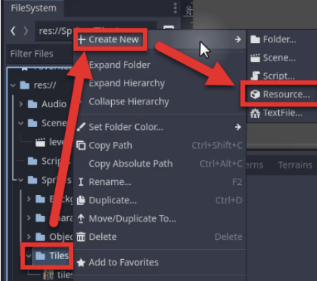

    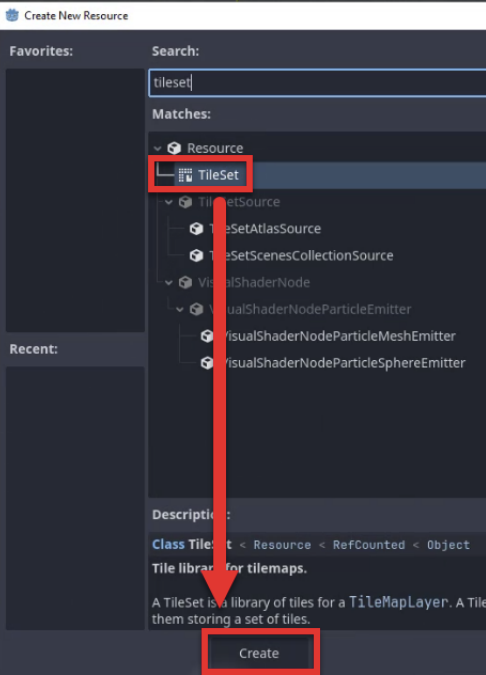

    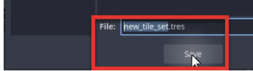
  </details>
- Double-click the tileset resource to open it in the bottom window (if not already open)
- Drag `tiles_packed.png` into the ‘Tile Sources’ section.
- Click yes to the 'atlas' popup
  <details><summary>image</summary>

    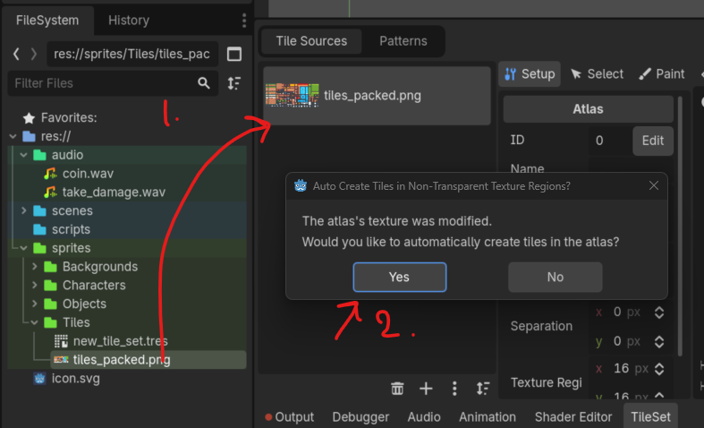
  </details>

### 2B. Fix tileset texture region size
- Select "Setup" tab in `TileSet` bottom window (if not already selected)
  - Adjust "texture region" from 16px to 18px
- In "inspector" panel on right side, adjust tile size to 18px
  <details><summary>image</summary>

    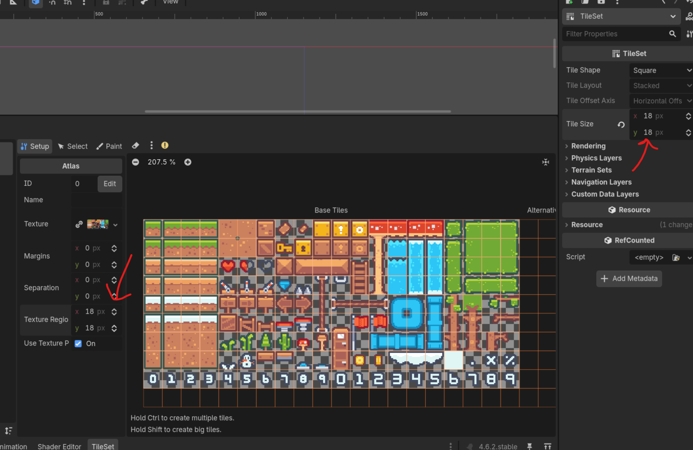
  </details>

### 2C. Add Collision properties to TileSet
- In "inspector" pannel on right side, click on "+ Add Element" under "Physics Layer"
  <details><summary>image</summary>

    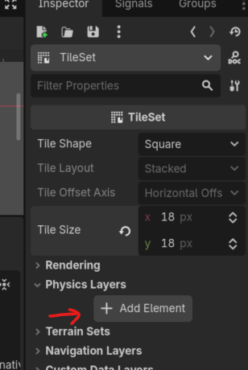
  </details>
- In `TileSet` bottom window, select `Paint` tab, then "Select a Property Editor", then "physics layer 0"
  <details><summary>image</summary>

    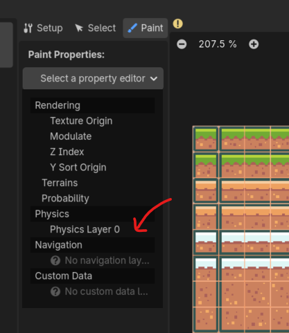
  </details>
- Select all the tiles that would need "physics" (aka "solid ground, so player doesn't fall through")
  <details><summary>image</summary>

    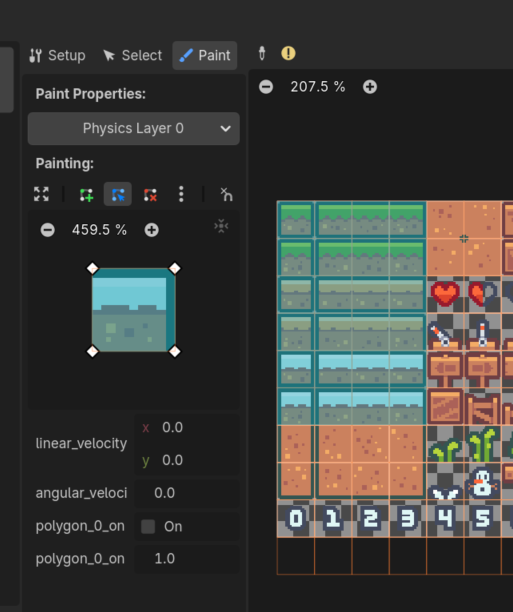
  </details>

### 2D. Setup `TileMapLayer` node
- Add `TileMapLayer` node to the scene
  <details><summary>image</summary>

    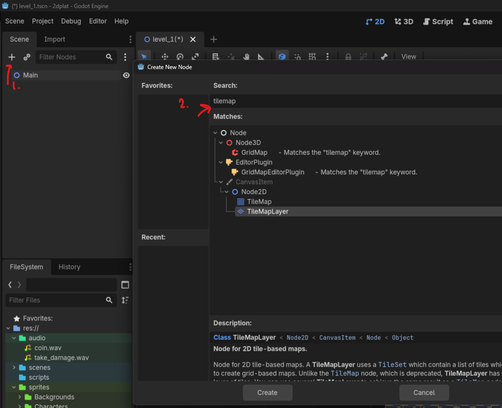
  </details>
- Add tileset resource to `TileMapLayer` node
  <details><summary>image</summary>

    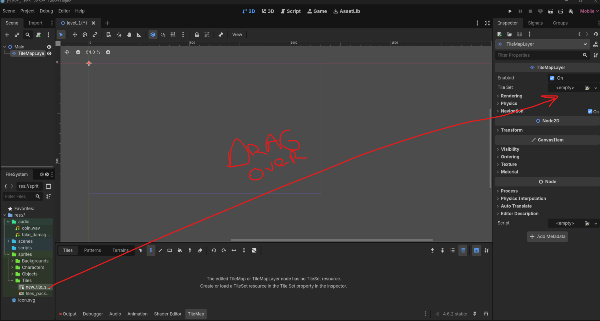
  </details>

### 2E. Fix blurry textures
- Go to Project > Project Settings
- Then Select Rendering > Textures
- Then in Default Texture Filter, change from "linear" to "nearest"      

### 2F. Add background to the level
- Drag the "backgroundForest.png" image from project folder on bottom left onto the scene
- Move the newly created "BackgroundForest" sprite node to the top, but below Main so that it appears behind the platforms


## 3. Create Player

### 3A. Setup Player scene
- Add to current scene, `CharacterBody2D` node
- Rename to "Player"
- Save it as scene, into scenes folder
- Open the "Player" scene
- Add character sprite to the scene
  - Rename the resulting node to "Sprite"
- Center the sprite by setting position to (0,0) in transform properties (inspector panel on right)
- Adjust offset of the sprite, so origin is at character's feet
  - Set "Y-Offset" to negative value
  <details><summary>image</summary>

    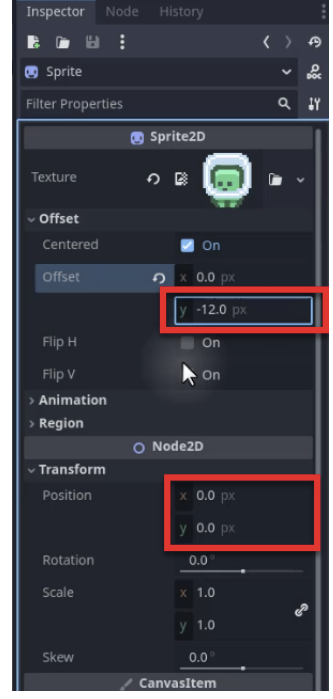
  </details>
- Add `CollisionShape2D` node to scene
  - In `CollisionShape2D` inspector window, add `New CapsuleShape2D`
  <details><summary>image</summary>

    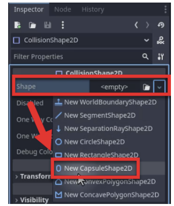
  </details>
  - Adjust collision shape so it fits the sprite, ensuring it touches the base of character's feet
- Add `Camera2D` node to scene
  - In inspector panel on right, adjust zoom property to (3,3)
  <details><summary>image</summary>

    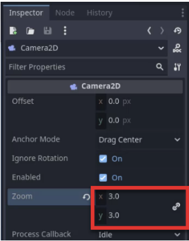
  </details>
  - Reposition camera as necessary

### 3B. Setup Input Actions
- Go to "Project" in top menu and select "Project Settings..."
- Select "Input Map" tab in the "Project Settings" window
- Create the actions: "move_left, move_right, jump"
- Add the following input keys for each (need to click on '+' icon on action)
  - move_left: Left Arrow Key, A Key
  - move_right: Right Arrow Key, D Key
  - jump: Up Arrow Key, Spacebar, W Key
    <details><summary>image</summary>

      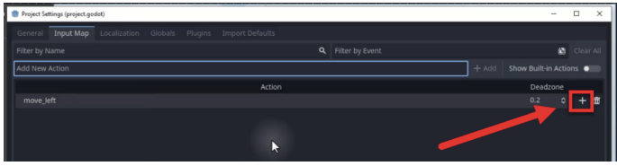

      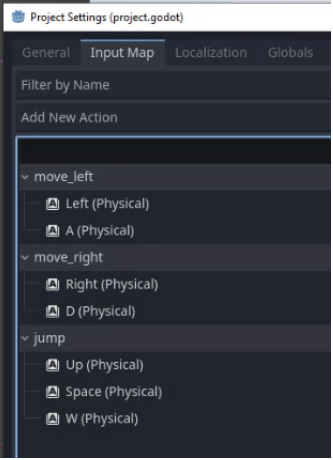
    </details>

### 3C. Setup Player script for left & right movement
- Select root node of `Player` scene
- In inspector panel on right, click on "Attach Script" icon at the bottom, and select "New Script" 
  <details><summary>image</summary>

    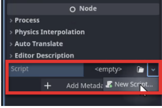
  </details>
- Save script as `player.gd` to the Scripts folder
- Implement code for player left and right movement

  <details><summary>code</summary>

    ```gd
    extends CharacterBody2D

    # The maximum speed at which the player can move
    @export var move_speed : float = 100

    # player’s input for movement
    var move_input : float

    func _physics_process(delta):
      # Get the move input
      move_input = Input.get_axis("move_left", "move_right")

      # Movement
      velocity.x = move_input * move_speed
      move_and_slide()
    ```
  </details>


### 3D. Add gravity to player so player falls instead of floating in mid-air
- Modify code to include velocity.y movement if player is not on floor
  <details><summary>code</summary>

    ```gd
    extends CharacterBody2D


    @export var move_speed : float = 100

    # NEW
    @export var gravity : float = 500 

    var move_input : float

    func _physics_process(delta):

      # NEW
      if not is_on_floor():
        velocity.y += gravity * delta
      
      move_input = Input.get_axis("move_left", "move_right")

      
      velocity.x = move_input * move_speed
      move_and_slide()
    ```
  </details>


### 3E. Add jumping
  <details><summary>code</summary>

    ```gd
    extends CharacterBody2D


    @export var move_speed : float = 100
    @export var gravity : float = 500 
    # NEW
    @export var jump_force : float = 200

    var move_input : float

    func _physics_process(delta):

      if not is_on_floor():
        velocity.y += gravity * delta
      
      move_input = Input.get_axis("move_left", "move_right")

      
      velocity.x = move_input * move_speed

      # NEW
      if Input.is_action_pressed("jump") and is_on_floor():
        velocity.y = -jump_force

      move_and_slide()
    ```
  </details>

### 3F. Smooth out character's movement

  <details><summary>code</summary>

    ```gd
    extends CharacterBody2D


    @export var move_speed : float = 100
    @export var gravity : float = 500 
    @export var jump_force : float = 200

    # NEW
    @export var acceleration : float = 50
    @export var braking : float = 20

    var move_input : float

    func _physics_process(delta):

      if not is_on_floor():
        velocity.y += gravity * delta
      
      move_input = Input.get_axis("move_left", "move_right")

      # NEW
      if move_input != 0:
        velocity.x = lerp(velocity.x, move_input * move_speed, acceleration * delta)
      else:
        velocity.x = lerp(velocity.x, 0.0, braking * delta)

      if Input.is_action_pressed("jump") and is_on_floor():
        velocity.y = -jump_force

      move_and_slide()
    ```
  </details>

### 3G. Flip sprite so it faces the direction player is moving in

  <details><summary>code</summary>

    ```gd
    extends CharacterBody2D


    @export var move_speed : float = 100
    @export var gravity : float = 500 
    @export var jump_force : float = 200

    @export var acceleration : float = 50
    @export var braking : float = 20

    var move_input : float

    # NEW
    @onready var sprite : Sprite2D = $Sprite

    func _physics_process(delta):

      if not is_on_floor():
        velocity.y += gravity * delta
      
      move_input = Input.get_axis("move_left", "move_right")

      if move_input != 0:
        velocity.x = lerp(velocity.x, move_input * move_speed, acceleration * delta)
      else:
        velocity.x = lerp(velocity.x, 0.0, braking * delta)

      if Input.is_action_pressed("jump") and is_on_floor():
        velocity.y = -jump_force

      move_and_slide()

    # NEW
    func _process(_delta):
      if velocity.x != 0:
        sprite.flip_h = velocity.x > 0
    ```
  </details>

### 3H. Setup character movement animation
- Add `AnimationPlayer` node to scene
- Select it to display the animation window at the bottom
- Create new animation, called "IDLE"
  <details><summary>image</summary>

    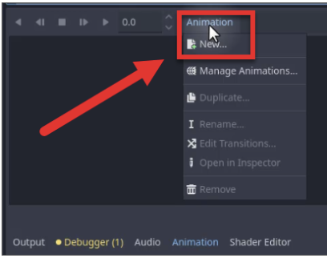
  </details>
- Change duration of animation to 0.5
  <details><summary>image</summary>

    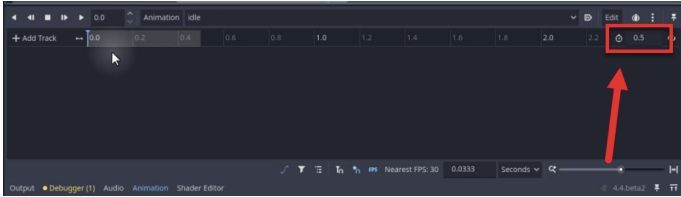
  </details>
- Add "IDLE" animation to animation timeline
  - select the `Sprite` node, then in the inspector panel on the right, click the white "key" icon next to "texture" property
  - Select "Create RESET Track(s)" in the pop-up window and then "Create"
  <details><summary>image</summary>

    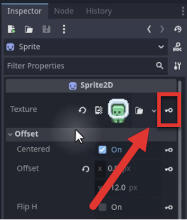
  </details>
- Add "MOVE" animation to animation track
  - do the same as above except, name it as "move"
  - then select the "keyframe" (the blue dot on the timeline); it should bring up the `animationtrackeyedit` property in the inspector panel
  - drag over the "movement character state" sprite (where legs are open), onto the "value" in the inspector
  <details><summary>image</summary>

    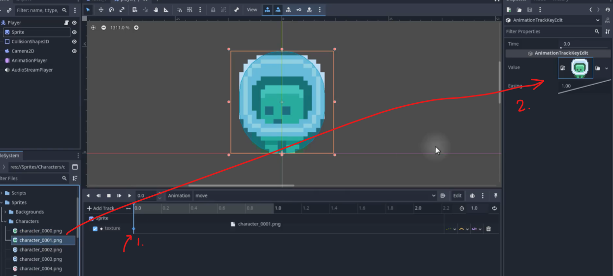
  </details>
  - then in the animation timeline, click somewhere in the middle and insert a key
  - then drag over the "idle character state" sprite (hwere legs are closed) over to the `AnimationTrackKeyEdit` in the inspector panel 
  <details><summary>image</summary>

    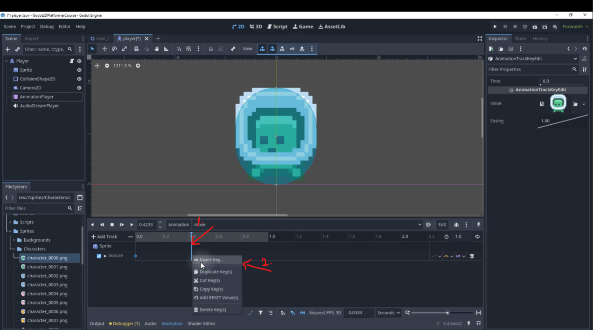

    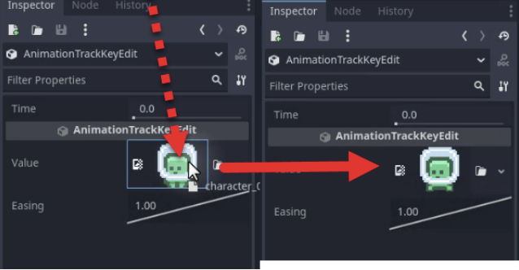
  </details>
  - enable the "loop" effect by clicking on the loop icon (two arrows in a circle) on the top right of animation window
  <details><summary>image</summary>

    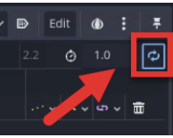
  </details>  
  - adjust the animation timeline duration and keyframes positions as necessary to make the animation look good

### 3I. Setup character jump animation
- Do the same as above, except name the animation as "jump" and change the texture for the key frame to the one "movement character state" sprite, where the characters legs are open

### 3J. Implement animations in code
  <details><summary>code</summary>

    ```gd
    # player.gd
    extends CharacterBody2D


    @export var move_speed : float = 100
    @export var gravity : float = 500 
    @export var jump_force : float = 200

    @export var acceleration : float = 50
    @export var braking : float = 20

    var move_input : float

    @onready var sprite : Sprite2D = $Sprite
    # NEW
    @onready var anim : AnimationPlayer = $AnimationPlayer

    func _physics_process(delta):

      if not is_on_floor():
        velocity.y += gravity * delta
      
      move_input = Input.get_axis("move_left", "move_right")

      if move_input != 0:
        velocity.x = lerp(velocity.x, move_input * move_speed, acceleration * delta)
      else:
        velocity.x = lerp(velocity.x, 0.0, braking * delta)

      if Input.is_action_pressed("jump") and is_on_floor():
        velocity.y = -jump_force

      move_and_slide()

    func _process(_delta):
      if velocity.x != 0:
        sprite.flip_h = velocity.x > 0

      # NEW
      _manage_animation()

    # NEW
    func _manage_animation ():
      if not is_on_floor():
        anim.play("jump")
      elif move_input != 0:
        anim.play("move")
      else:
        anim.play("idle")
    ```
  </details>

## 4. Create Enemy

### 4A. Setup Enemy Scene
- Select "level_1" scene (main scene)
- Add `Area2D` node and rename to "Enemy"
- Save scene as "enemy.tscn" into scenes folder
- Open "enemy.tscn" scene
- Drag over enemy sprite into the scene
  - rename the resulting node to "Sprite"
  - center the sprite by setting (0,0) to the position property in the inspector
- Add `CollisionShape2D` node to the scene
  - Add `New CircleShape2D` shape to the node (like with Player)
  - Adjust the shape over the sprite

### 4B. Code enemy automatic patrol between two points
- Select root node in "enemy" scene
- Create and attach new script, named "enemy.gd".
- Save to scripts folder
  <details><summary>code</summary>

      ```gd
      extends Area2D

      @export var move_direction : Vector2
      @export var move_speed : float = 20

      @onready var start_pos : Vector2 = global_position
      @onready var target_pos : Vector2 = global_position + move_direction

      func _physics_process(delta):
        global_position = global_position.move_toward(target_pos, move_speed * delta)
        
        if global_position == target_pos:
          if target_pos == start_pos:
            target_pos = start_pos + move_direction
          else:
            target_pos = start_pos
      ```
  </details>
- Back in "level_1" scene, position enemy somewhere to have it move
  - set "move direction" property values in inspector (example, set y to -50, to have enemy move up and down)
  - confirm enemy movement by playing the game

### 4C. Implement enemy detection of player collision (touch)
- Select enemy root node (Area2D)
  - Go to Inspector panel, and click the "Node" tab, then select "Signals"
  - Select "body_entered(body:Node2D)", double-click, and select "Connect"  
  <details><summary>image</summary>


    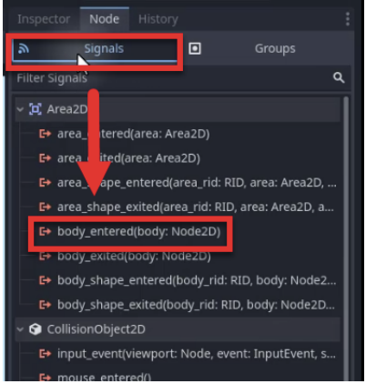

    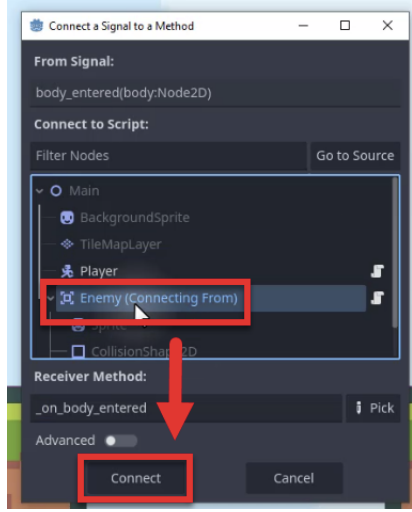
  </details>    
  - Select the player node, then go to the Node panel, and click on "Groups" tab
    - click on the "+" icon to create a new group, labelled "Player"
  <details><summary>image</summary>

    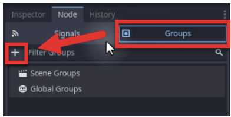

    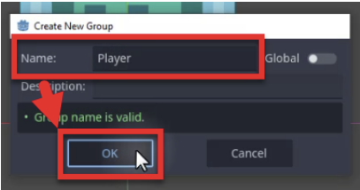
  </details>  
  - Modify `enemy.gd` script so that we can show that enemy is able to handle player detection (via console printing)
  <details><summary>code</summary>

      ```gd
        extends Area2D

        @export var move_direction : Vector2
        @export var move_speed : float = 20

        @onready var start_pos : Vector2 = global_position
        @onready var target_pos : Vector2 = global_position + move_direction

        func _physics_process(delta):
          global_position = global_position.move_toward(target_pos, move_speed * delta)
          
          if global_position == target_pos:
            if target_pos == start_pos:
              target_pos = start_pos + move_direction
            else:
              target_pos = start_pos

        # NEW
        func _on_body_entered(body):
          if not body.is_in_group("Player"):
            return
          
          body.take_damage(1)
      ```
  </details>
  - If you play the game and touch an enemy, you should see the message pop-up in the console output
  <details><summary>image</summary>

    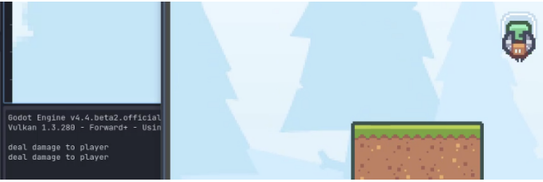
  </details> 

### 4D. Implement Enemy animations
- Add "AnimationPlayer" to the "Enemy" scene
- Just like with Player, create new animation labelled "fly"
- add track for Sprite's texture
- Set animation duration to 0.3
- Move the timeline to about 0.1 seconds, and create new keyframe (right-click on track and select "Insert key")
- With the keyframe selected, swap out the texture so its the same sprite, but in a different state of movement
- Repeat until you use up all the enemy sprites
- Enable looping for the animation
- Play the animation to confirm it looks fine
- Add the following code to "enemy.gd" script:

  ```gd
  func _ready():
    $AnimationPlayer.play("fly")
  ```

## 5. Implement Game Over

### 5A. Update player.gd script
- Open `player.gd` script
- Need to add variable for tracking player health, function for decreasing health (damage), and function for ending the game 
<details><summary>code</summary>


  ```gd
    # player.gd

    # add the following code to the script:

    @export var health : int = 3

    func take_damage (amount : int):
      health -= amount
      
      if health <= 0:
        call_deferred("game_over")

    # reloads current scene; later it will be modified to return player to main menu
    func game_over ():
      get_tree().change_scene_to_file("res://Scenes/level_1.tscn")
  ```
</details>

### 5B. Update enemy.gd script
- Update `enemy.gd` script to call the player `take_damage()` function when `on_body_entered()` is triggered

  ```gd
    # enemy.gd
    func _on_body_entered(body):
      if not body.is_in_group("Player"):
        return
      body.take_damage(1)
  ```
- Test out functionality by playing the game, touching an enemy, and seeing if the level resets

## 6. Create coin

### 6A. Setup Coin scene
- Create new scene and add `Area2D` node, renaming it to "Coin"
- Save as `coin.tscn` to scene folder, and open it up
- Drag and drop the coin sprite onto the scene
  - rename the resulting node to "Sprite"
  - position the sprite node to (0,0) (in the inspector, on the position fields)
- Add a `CollisionShape2D` node
  - set `CircleShape2D` to it, and adjust/position as necessary so it covers the sprite

### 6B. Animate the Coin
- Attach script called "coin.gd" to Coin root node
- implement rotate & bobbing up and down functionalities

  <details><summary>code</summary>

    ```gd
      extends Area2D

      var rotate_speed : float = 3.0
      var bob_height : float = 5.0
      var bob_speed : float = 5.0

      @onready var start_pos : Vector2 = global_position
      @onready var sprite : Sprite2D = $Sprite

      func _physics_process(_delta):
        var time = Time.get_unix_time_from_system()
        
        # rotate
        sprite.scale.x = sin(time * rotate_speed)
        
        # bob up and down
        var y_pos = ((1 + sin(time * bob_speed)) / 2) * bob_height
        global_position.y = start_pos.y - y_pos
    ```
  </details>

### 6C. Implement coin collection & score increase
- Open `player.gd` and add the following code to it:
  ```gd
    func increase_score(amount: int):
    print("increase score")
  ```
- Add `body_entered` signal to coin:
  - Select Coin root node
  - Go to Node Tab (panel on the right)
  - Select Signals, and then find and select `body_entered(body: Node2D)`
  - Double-click on it and follow the prompts to connect it to the `coin.gd` script
  - add the following code inside of `coin.gd` script, under `_on_body_entered(body):` function
  ```gd
    func _on_body_entered(body):
      if not body.is_in_group("Player"):
        return
      body.increase_score(1)
      queue_free()
  ```
  - test if player can collect coins


### 6D. Persist scores across levels
- Currently, score resets when new scene/level loads
- Go to Project -> Project Settings
- Navigate to Globals and in the "Node Name" field, enter "PlayerStats" and click Add
- When prompted, save script as "player_stats.gd" to Scripts folder
  <details><summary>image</summary>

    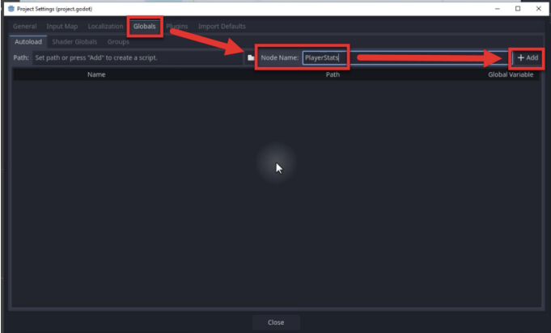
  </details>
- Doing this will add the script to the "Autoload" list
- Open the "player_stats.gd" script and put:
  ```gd
    extends Node

    var score : int = 0
  ```
- Open "player.gd" script, and modify the `increase_score()` function, 

  ```gd
    func increase_score (amount : int):
      PlayerStats.score += amount
      OnUpdateScore.emit(PlayerStats.score)
      play_sound(coin_sfx)
  ```
- Should see score persist from level to level

## 7. Create End Flag

### 7A. Create End Flag
- Create new scene with Area2D Node and rename it and save scene as "EndFlag"
- Add "flag" sprite to the scene and rename the node to Sprite
  - Set position of sprite to (0,0)
- Add CollisionShape2D node
  - Set shape to CircleShape2D and size/position it accordingly
 